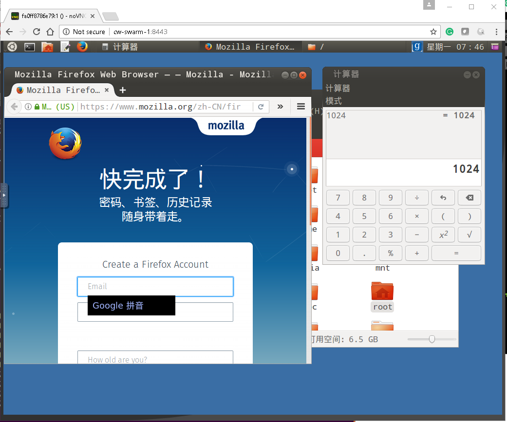

# Ubuntu Classic Desktop (GNOME-3 Flashback)

------------------------------------------



## Try Ubuntu Classic Desktop in Docker (with VNC):

```sh
docker run -it -d --name flashback -h flashback -p 5901:5901 -v /external:/root ghostplant/flashback
```

Then use Linux Gvncviewer or Windows RealVNC to login:

```sh
gvncviewer localhost:1 # default password is 123456 for the first login, using 'vncpasswd' to change it
```

------------------------------------------

## Try Ubuntu Classic Desktop ISO in Laptop/VM (CD Version to setup):

Download tarball (>= 330M) via (http://ppa.launchpad.net/ghostplant/flashback/ubuntu/pool/main/x/xenial-classic-desktop-amd64/), and exact the ISO cdimage file in it.

------------------------------------------

## Reporting Issues

You can post issues here for any suggestions to improve Ubuntu Classic Desktop. To report a new issue, you are supposed to have a GitHub account and log in with it in the first place. Then, get access to [new issue](https://github.com/ghostplant/ubuntu-classic/issues/new), fill in the block with what you want to report, and finally submit this issue.

你可以在这里以提交 Issues 的形式向我们反馈 Ubuntu Classic Desktop 的使用建议。你需要一个 GitHub 帐号来登录到 GitHub 平台，然后打开 [这里](https://github.com/ghostplant/ubuntu-classic/issues/new)，将建议填入表格中并提交即可。

