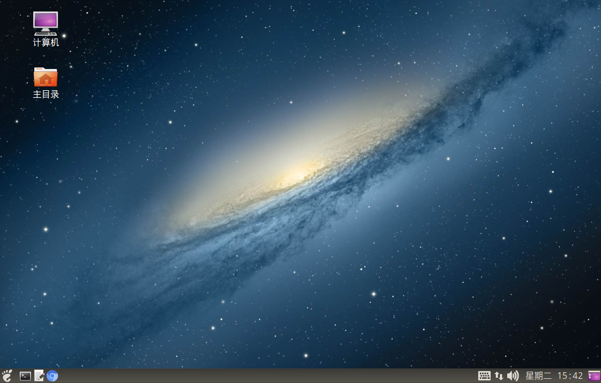
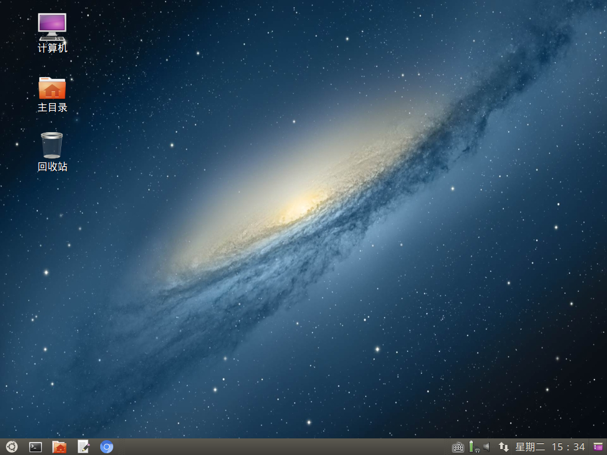

# Ubuntu Classic Desktop (GTK3-based Desktop Environment)

------------------------------------------

## a. Run Ubuntu Classic Desktop on Bare Metal (with CDROM):

### Ubuntu 18.04 LTS CDImage Download Links (Chinese Simplified, ~441MB):

64 bit: https://github.com/ghostplant/web-ubuntu-mate/releases/download/ubuntu-18.04/bionic-mate-amd64-20190205.iso

32 bit: https://github.com/ghostplant/web-ubuntu-mate/releases/download/ubuntu-18.04/bionic-mate-i386-20190205.iso

### Ubuntu 16.04 LTS CDImage Download Links (Chinese Simplified, ~378MB):

http://ppa.launchpad.net/ghostplant/flashback/ubuntu/pool/main/x/xenial-classic-desktop-amd64/

------------------------------------------

## b. Run Ubuntu Classic Desktop in Docker (with VNC):
(Default VNC password: 123456, and you can update it via 'vncpasswd' command inside VNC X session)

```sh
# Download/Update latest Ubuntu image
docker pull ghostplant/flashback

# Chioce 1 - Web as Client: Using web browser to login - http://localhost:8443/
docker run -it --rm -p 8443:8443 -v /external:/root ghostplant/flashback

# Chioce 2 - VNCViewer as Client: Using VNC client to login 'localhost:1'
docker run -it --rm -p 5901:5901 -v /external:/root ghostplant/flashback

# Other Example 1 - Language: Set locale to en_US.UTF-8
docker run -it --rm -e LANG=en_US.UTF-8 -p 8443:8443 -p 5901:5901 -v /external:/root ghostplant/flashback

# Other Example 2 - Resolution Size : Set display resolution to 1366x768
docker run -it --rm -e GEOMETRY=1366x768 -p 8443:8443 -p 5901:5901 -v /external:/root ghostplant/flashback

# Other Example 3 - Initial Password: Set initial VNC password (length of password must be between 6 to 8).
docker run -it --rm -e INIT_PASS=123456 -p 8443:8443 -p 5901:5901 -v /external:/root ghostplant/flashback

# Other Example 4 - Resolution Quality: Using 24-bit high resolution quality (Only recommended in high-bandwidth network)
docker run -it --rm -e INIT_PASS=123456 -e DEPTH=24 -p 8443:8443 -p 5901:5901 -v /external:/root ghostplant/flashback
```

Then use Firefox/Chrome/IE11 to login if you expose port 8443:

```sh
x-www-browser http://localhost:8443/

x-www-browser https://localhost:8443/
```

or use Linux Gvncviewer or Windows RealVNC to login if you expose port 5901:

```sh
gvncviewer localhost:1
```
------------------------------------------

## Ubuntu 18.04 LTS Preview



## Ubuntu 16.04 LTS Preview



------------------------------------------

## Reporting Issues

You can post issues here for any suggestions to improve Ubuntu Classic Desktop. To report a new issue, you are supposed to have a GitHub account and log in with it in the first place. Then, get access to [new issue](https://github.com/ghostplant/ubuntu-classic/issues/new), fill in the block with what you want to report, and finally submit this issue.
